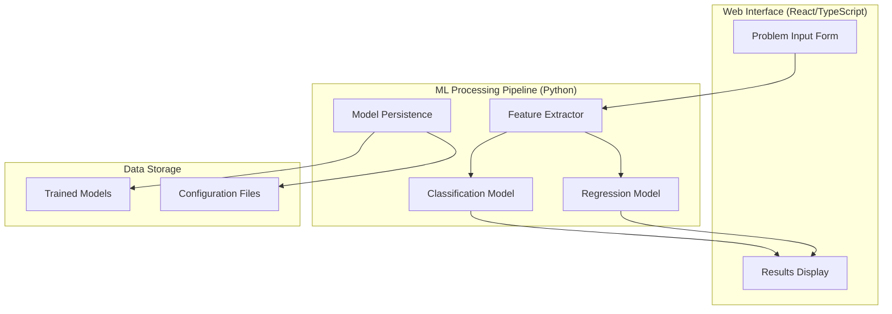

# Design Document: AutoJudge Difficulty Predictor

## Overview

The AutoJudge Difficulty Predictor is a machine learning system that automatically assesses programming problem difficulty through both classification and regression models. The system processes textual problem descriptions and provides dual predictions: categorical difficulty levels (Easy/Medium/Hard) and numerical difficulty scores.

The architecture follows a modular design with clear separation between data processing, machine learning models, and the web interface. This enables independent development, testing, and maintenance of each component while ensuring seamless integration.

## Architecture

The system employs a three-tier architecture:

1. **Presentation Layer**: React TypeScript web interface for user interaction
2. **Processing Layer**: Python-based machine learning pipeline with feature extraction and model inference
3. **Data Layer**: Model persistence and configuration management



## Components and Interfaces

### Feature Extraction Component

**Purpose**: Converts raw problem text into numerical features suitable for machine learning models.

**Key Features**:
- Text preprocessing and cleaning
- TF-IDF vectorization for semantic content analysis
- Statistical feature extraction (text length, keyword counts)
- Mathematical symbol detection for programming complexity assessment

**Interface**:
```python
class FeatureExtractor:
    def extract_features(self, problem_text: ProblemText) -> FeatureVector
    def fit_transform(self, training_data: List[ProblemText]) -> np.ndarray
    def transform(self, problem_text: ProblemText) -> np.ndarray
```

**Implementation Strategy**:
- Use scikit-learn's TfidfVectorizer for semantic features
- Implement custom extractors for domain-specific features (mathematical symbols, programming keywords)
- Apply text preprocessing (lowercasing, punctuation handling, stop word removal)
- Combine multiple feature types into unified feature vectors

### Classification Model Component

**Purpose**: Predicts categorical difficulty levels (Easy/Medium/Hard) from feature vectors.

**Model Selection**: Random Forest Classifier based on research showing superior performance over logistic regression for text classification tasks.

**Interface**:
```python
class DifficultyClassifier:
    def train(self, features: np.ndarray, labels: np.ndarray) -> None
    def predict(self, features: np.ndarray) -> str
    def predict_proba(self, features: np.ndarray) -> np.ndarray
    def evaluate(self, test_features: np.ndarray, test_labels: np.ndarray) -> ClassificationMetrics
```

**Configuration**:
- n_estimators: 100 (balance between performance and training time)
- max_depth: None (allow trees to grow until pure leaves)
- random_state: 42 (reproducible results)

### Regression Model Component

**Purpose**: Predicts numerical difficulty scores from feature vectors.

**Model Selection**: Random Forest Regressor for consistency with classification approach and robust performance.

**Interface**:
```python
class DifficultyRegressor:
    def train(self, features: np.ndarray, scores: np.ndarray) -> None
    def predict(self, features: np.ndarray) -> float
    def evaluate(self, test_features: np.ndarray, test_scores: np.ndarray) -> RegressionMetrics
```

### Web Interface Component

**Purpose**: Provides user-friendly interface for problem input and result display.

**Technology Stack**: React with TypeScript for type safety and maintainability.

**Key Components**:
- ProblemInputForm: Multi-line text areas for problem description, input specification, and output specification
- PredictionButton: Triggers the ML pipeline processing
- ResultsDisplay: Shows both classification and regression predictions
- ErrorHandling: Graceful handling of processing failures

**Interface Design**:
```typescript
interface ProblemInput {
  title: string;
  description: string;
  inputDescription: string;
  outputDescription: string;
}

interface PredictionResult {
  difficulty_class: 'Easy' | 'Medium' | 'Hard';
  difficulty_score: number;
  confidence?: number;
}
```

## Data Models

### Problem Text Structure
```python
@dataclass
class ProblemText:
    title: str
    description: str
    input_description: str
    output_description: str
    
    def get_combined_text(self) -> str:
        return f"{self.title} {self.description} {self.input_description} {self.output_description}"
```

### Feature Vector Structure
```python
@dataclass
class FeatureVector:
    tfidf_features: np.ndarray  # TF-IDF semantic features
    statistical_features: np.ndarray  # Length, keyword counts, etc.
    
    def to_array(self) -> np.ndarray:
        return np.concatenate([self.tfidf_features, self.statistical_features])
```

### Model Evaluation Metrics
```python
@dataclass
class ClassificationMetrics:
    accuracy: float
    precision: Dict[str, float]
    recall: Dict[str, float]
    f1_score: Dict[str, float]
    confusion_matrix: np.ndarray

@dataclass
class RegressionMetrics:
    mae: float  # Mean Absolute Error
    rmse: float  # Root Mean Square Error
    r2_score: float  # R-squared
```

## Correctness Properties

*A property is a characteristic or behavior that should hold true across all valid executions of a system—essentially, a formal statement about what the system should do. Properties serve as the bridge between human-readable specifications and machine-verifiable correctness guarantees.*

### Property 1: Text Combination Consistency
*For any* valid problem text with title, description, input_description, and output_description fields, the combined text should contain all original content in the correct order.
**Validates: Requirements 1.1**

### Property 2: Graceful Missing Value Handling
*For any* problem text with missing or None values in any field, the feature extractor should complete processing without throwing exceptions.
**Validates: Requirements 1.2**

### Property 3: Text Length Feature Accuracy
*For any* combined text input, the extracted text length feature should exactly match the actual character count of the text.
**Validates: Requirements 1.3**

### Property 4: Symbol and Keyword Counting Accuracy
*For any* text containing known quantities of mathematical symbols and programming keywords, the extracted counts should match the actual occurrences.
**Validates: Requirements 1.4**

### Property 5: TF-IDF Vector Validity
*For any* valid text input, the generated TF-IDF vector should be a numerical array with consistent dimensions and no invalid values (NaN, infinity).
**Validates: Requirements 1.5**

### Property 6: Feature Vector Consistency
*For any* problem text input, the feature extraction process should always produce a feature vector with the same dimensions and data types.
**Validates: Requirements 1.6**

### Property 7: Classification Output Validity
*For any* valid feature vector input, the classification model should always predict exactly one of the three valid categories: Easy, Medium, or Hard.
**Validates: Requirements 2.1, 2.2**

### Property 8: Classification Error Handling
*For any* invalid feature vector input (wrong dimensions, invalid values), the classification model should handle the error gracefully without crashing.
**Validates: Requirements 2.4**

### Property 9: Regression Output Validity
*For any* valid feature vector input, the regression model should always return a single finite numerical score (not NaN or infinity).
**Validates: Requirements 3.1, 3.2**

### Property 10: Regression Error Handling
*For any* invalid feature vector input, the regression model should handle the error gracefully without crashing.
**Validates: Requirements 3.4**

### Property 11: Evaluation Metrics Validity
*For any* valid predictions and ground truth labels, calculated accuracy should be between 0 and 1, and MAE/RMSE should be non-negative finite values.
**Validates: Requirements 4.1, 4.3, 4.4**

### Property 12: Confusion Matrix Structure
*For any* classification evaluation with three classes, the confusion matrix should be a 3x3 matrix with non-negative integer values.
**Validates: Requirements 4.2**

### Property 13: Multi-line Text Handling
*For any* text input containing newline characters, the web interface should preserve and correctly process the multi-line content.
**Validates: Requirements 5.2**

### Property 14: Empty Input Handling
*For any* form submission with empty text fields, the web interface should handle the case gracefully without causing system errors.
**Validates: Requirements 5.4**

### Property 15: Prediction Display Completeness
*For any* successful prediction, the web interface should display both the difficulty class and numerical score.
**Validates: Requirements 6.1, 6.2**

### Property 16: Error Message Display
*For any* prediction failure, the web interface should display an appropriate error message instead of crashing or showing invalid results.
**Validates: Requirements 6.4**

### Property 17: UI Reactivity
*For any* prediction completion event, the web interface should update the display immediately to reflect the new results.
**Validates: Requirements 6.5**

### Property 18: End-to-End Pipeline Processing
*For any* valid problem text input, the complete system should process it through feature extraction, both models, and return valid predictions.
**Validates: Requirements 7.1, 7.2, 7.3**

### Property 19: System Error Resilience
*For any* error occurring at any stage of the pipeline, the system should handle it gracefully without crashing the entire application.
**Validates: Requirements 7.4**

### Property 20: Model Persistence Round Trip
*For any* trained model, saving and then loading should produce a model that makes identical predictions on the same inputs.
**Validates: Requirements 8.1, 8.2**

### Property 21: Missing Model File Handling
*For any* attempt to load models when files are missing or corrupted, the system should handle the error gracefully and provide meaningful feedback.
**Validates: Requirements 8.3**

### Property 22: Model Compatibility Verification
*For any* loaded model, the system should verify that it's compatible with the current feature extraction process before allowing predictions.
**Validates: Requirements 8.4**

## Error Handling

The system implements comprehensive error handling at multiple levels:

### Input Validation
- **Text Input Sanitization**: Remove or escape potentially harmful characters
- **Field Validation**: Ensure required fields are present and non-empty
- **Format Validation**: Verify input conforms to expected structure

### Model Error Handling
- **Feature Extraction Errors**: Handle malformed text, encoding issues, and missing data
- **Prediction Errors**: Manage model failures, invalid inputs, and resource constraints
- **Model Loading Errors**: Handle missing files, version mismatches, and corruption

### Web Interface Error Handling
- **Network Errors**: Graceful handling of API communication failures
- **Validation Errors**: Clear user feedback for invalid inputs
- **System Errors**: User-friendly error messages for internal failures

### Error Recovery Strategies
- **Graceful Degradation**: Provide partial functionality when possible
- **Retry Mechanisms**: Automatic retry for transient failures
- **Fallback Options**: Default behaviors when primary systems fail

## Testing Strategy

The testing approach combines unit testing for specific behaviors with property-based testing for comprehensive validation across input spaces.

### Unit Testing
Unit tests focus on specific examples, edge cases, and integration points:

- **Component Integration**: Verify proper interaction between feature extraction, models, and web interface
- **Edge Case Validation**: Test boundary conditions like empty inputs, extremely long text, and special characters
- **Error Condition Testing**: Validate error handling for various failure scenarios
- **API Contract Testing**: Ensure web interface correctly communicates with ML backend

### Property-Based Testing
Property-based tests validate universal properties across randomized inputs using **Hypothesis** for Python components and **fast-check** for TypeScript components:

- **Minimum 100 iterations** per property test to ensure comprehensive coverage
- **Smart Generators**: Create realistic problem text with appropriate distributions of length, complexity, and content
- **Invariant Testing**: Verify properties that should hold regardless of specific input values
- **Round-trip Testing**: Validate serialization/deserialization and save/load operations

### Test Configuration
Each property-based test must include:
- **Feature Tag**: `Feature: autojudge-difficulty-predictor`
- **Property Reference**: `Property {number}: {property_text}`
- **Requirements Mapping**: Clear traceability to validated requirements

### Model Validation Testing
- **Cross-validation**: K-fold validation to assess model generalization
- **Performance Benchmarking**: Consistent evaluation metrics across model versions
- **Data Distribution Testing**: Verify model performance across different problem types and difficulties

### Integration Testing
- **End-to-End Workflows**: Complete user journeys from input to prediction display
- **API Integration**: Verify proper communication between frontend and backend
- **Error Propagation**: Ensure errors are properly handled and communicated across system boundaries